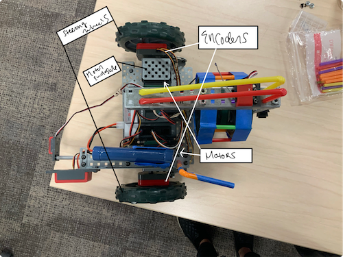
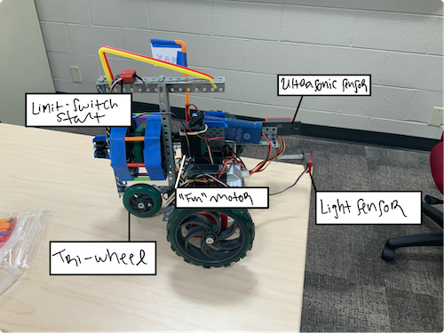

# autonomousmazenavigator
RobotC program that implements PID and Wall Follower algorithms. Guides our bot Mad Max
through simply connected mazes.

# Mad Max
Top View

Left View

Right View

### authors
Aidan, Murun, and Elle
