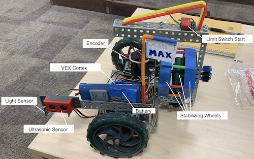

# autonomousmazenavigator
RobotC program that implements PID and Wall Follower algorithms. Guides our bot Mad Max
through simply connected mazes.

# mad max

# hardware
Brain: VEX motor controller\
Left hand: ultrasonic sensor (used to detect left wall)\
Eyes: light sensor (used to detect if too close to wall in front)\
Feet: wheels and encoders

# in action

### authors
Aidan, Murun, and Elle
